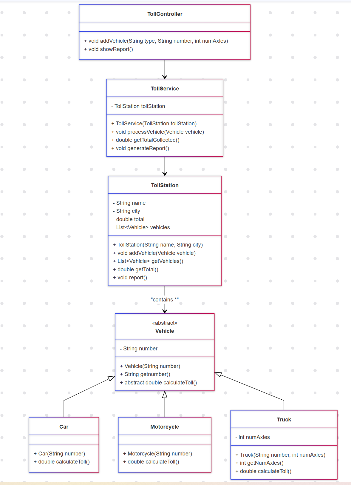

# Toll Station System

This project is designed to model a toll station system. The toll stations have a name, a city where they are located, and a numerical value representing the total toll collected.

## Table of Contents
- [Description](#description)
- [Features](#features)
- [Structure](#structure)
- [Installation](#installation)
- [Usage](#usage)
- [Testing](#testing)
- [Class Diagram](#class-diagram)
- [Contacts](#contacts)

## Description

The toll station system calculates the toll value for different types of vehicles that arrive at the station and keeps track of the total toll collected. The system supports the following vehicle types:
- **Car**: Toll value is $100.
- **Motorcycle**: Toll value is $50.
- **Truck**: Toll value depends on the number of axles, charging $50 per axle.

At the end, the system prints a list of vehicles that arrived at the toll station and the total collected toll.

## Features
- Calculate toll values for different types of vehicles.
- Track the total toll collected at the toll station.
- Print a summary of vehicles and total toll collected.

## Structure

```
src/
├── App.java
├── model/
│   ├── TollStation.java
│   ├── Vehicle.java
│   ├── Car.java
│   ├── Motorcycle.java
│   ├── Truck.java
├── service/
│   ├── TollService.java
├── controller/
│   ├── TollController.java
└── test/
    ├── TollStationTest.java
    ├── VehicleTest.java
    ├── CarTest.java
    ├── MotorcycleTest.java
    ├── TruckTest.java
    ├── TollServiceTest.java
    ├── TollControllerTest.java
```

## Installation
To get started with the project, follow these steps:

1. Clone the repository:
    ```sh
    git clone https://github.com/NelliYanchuk/java-toll-station.git
    cd java-toll-station
    ```

2. Compile the project:
    ```sh
    javac -d bin src/*.java
    ```

3. Run the project:
    ```sh
    java -cp bin Main
    ```

## Usage
The project simulates a toll station system. You can modify the `Main.java` file to test different scenarios with various vehicles.

## Testing
Unit tests are included to ensure the functionality of the toll station system. The project aims for a minimum test coverage of 70%.

To run the tests:
1. Compile the tests:
    ```sh
    javac -d bin -cp .:junit-4.13.2.jar:hamcrest-core-1.3.jar test/*.java
    ```

2. Run the tests:
    ```sh
    java -cp .:bin:junit-4.13.2.jar:hamcrest-core-1.3.jar org.junit.runner.JUnitCore TestClassName
    ```

Replace `TestClassName` with the name of the test class you want to run.

### Test Coverage
You can verify the test coverage using VSCode or any other preferred tool. Here is an example screenshot of the testing section:


## Class Diagram
The class diagram:



## Contacts
Contact me with:
**Nelli Yanchuk** [GitHub](https://github.com/NelliYanchuk) / [LinkedIn](https://www.linkedin.com/in/nelli-yanchuk-a24b81138/)
